# Atölye 1 - Veriyi anlama

Veri bilimi sürecinin ilk aşaması ihtiyacın anlaşılmasıdır. Bu aşamada sahip olunan verinin derinliklerine inmeden önce durumu, paydaşları
, makina öğrenmesi modelinin olası kategorisini ve proje planını anlamak için uğraş verilir. İkinci aşama ise sahip olduğunuz veriyi detaylı inceleyerek modelinizi eğitmek için kullanıp kullanamayacağınızı anlamaya çalışmaktır. Bu atölye çalışmasında ikinci aşamaya yoğunlaşacaksınız ve verinizi inceleyebilmek için sunucusuz bir mimari oluşturacaksınız.

Amazon Glue kullanarak Glue Data Catalog'da tablolar yaratacaksınız ve Amazon S3 bucket'da bulunan verinizi inceleyeceksiniz. Amazon Athena ile SQL sorguları çalıştırarak verinizi anlayacaksınız. 

Kendinize sizi diğer atölye katılımcılarından ayıracak bir paraf seçin (Ad ve soyadınızın ilk hafleri veya kısa bir nickname olabilir). Atölye esnasında oluşturduğunuz kaynakların başında bu parafı kullanacaksınız. 

* [Bir bucket oluşturma ve içine veriyi kopyalama](#bucket)
* [AWS Glue Crawler ile veriyi keşif](#discover)
* [Amazon Athena ile veriyi inceleme](#explore)

***

### <a name="bucket">Bir bucket oluşturma ve içine veriyi kopyalama</a>

Atölye çalışmasının ilk bölümünde öncelikle Amazon S3'de bir bucket yaratacaksınız. Sonra film değerlendirme verisi ve izleyici verisi içeren dosyaları bu bucket'a kopyalayacaksınız.

1. AWS Yönetim Konsolu'na login olun <https://console.aws.amazon.com/>.

2. AWS Yönetim Konsolunda sağ üst köşede bulunan AWS Region listesinden uygun birini seçin ve adını bir kenara not alın **Amazon Sagemaker servisinin sunulduğu bir Region'ı seçtiğinizden emin olun:** 
    
    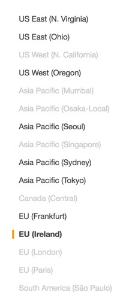

3. [Bu linki](https://console.aws.amazon.com/s3/home) kullanarak Amazon S3 konsoluna erişin ve gelen ekranda ekranda **Create Bucket** butonuna tıklayın

4. **Bucket name** alanına **[paraf]-movielab** formatında oluşturacağınız bucket'ın adını girin. Örneğin parafınız baya ise baya-movielab. Bucket isimleri global olarak unique olmak zorunda, eğer hata alırsanız bucket ismini değiştirerek tekrar deneyin. Bucket adını not alın.
5. **Region** olarak yukarıda not aldığınız Region’ı seçin, sonraki ekranlarda **Next**'e tıklayın ve son ekranın sol alt köşesinde bulunan **Create** butonuna tıklayarak bucket’ınızı yaratın
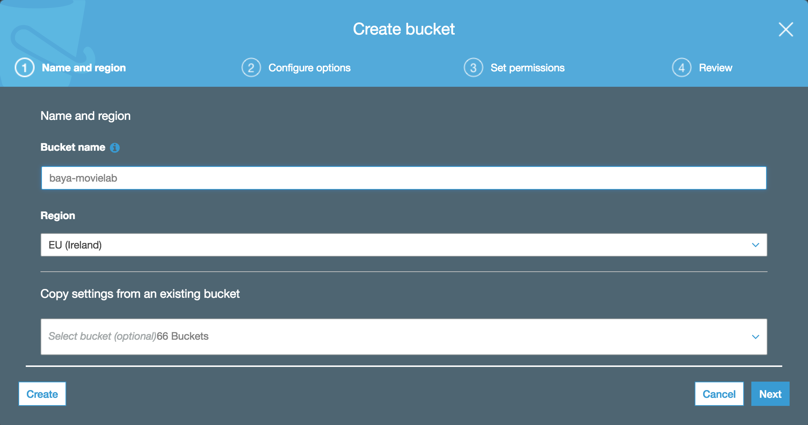

6. [Bu linki](http://files.grouplens.org/datasets/movielens/ml-latest-small.zip) kullanarak örnek veri setini bilgisayarınıza indirin ve unzipleyin. Unziplenmiş klasöre girin. README.txt dosyasını silin. Glue Crawler'ın düzgün çalışabilmesi için .csv dosyaları kendi klasörlerinin içinde tek başlarına bulunmalılar. Her bir csv dosyası için aynı isimde birer klasör yaratın ve .csv dosyasını kendi klasörüne kesip yapıştırın
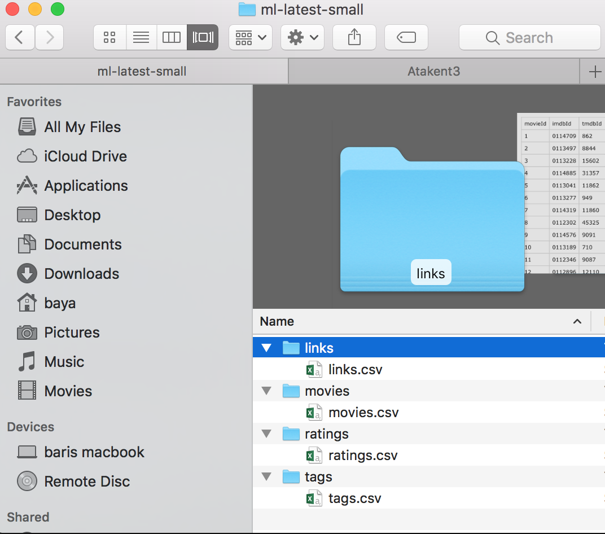

7. Bucket listesinden yarattığınız bucket'ı bulup üzerine tıklayın ve açılan ekranda **+Create Folder** butonuna tıklayın. Klasör adı olarak **movielens-data** yazın ve **Save** butonuna tıklayın
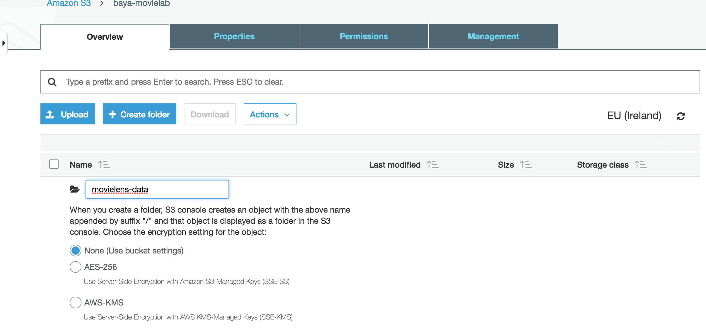

8. Oluşturduğunuz klasörün içine, üzerine tıklayarak girin ve **Upload** butonuna tıklayın. Unziplediğiniz ve içinde yeni klasörler açtığınız ana klasörü **Drag and drop here** yazılı bölgeye taşıyın. Sonraki ekranları **Next**'e tıklayarak geçin ve en son upload butonuna basarak klasörün bucket'ınıza yüklenmesini sağlayın.  
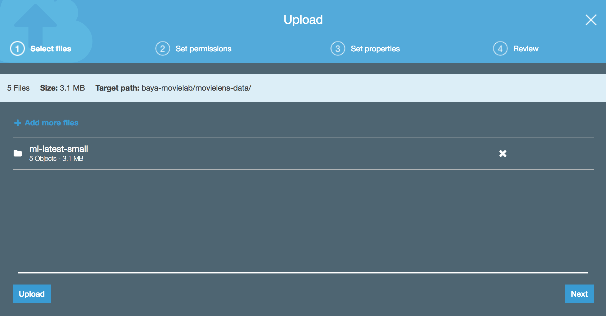
 
***


### <a name="discover">AWS Glue Crawler kullanarak veriyi inceleyin</a>

Atölye çalışmasının ikinci aşamasında AWS Glue kullanarak S3 buckettaki bütün veriyi crawl edeceğiz ve Glue Data Catalog ile tabloların otomatik yaratılmasını sağlayacağız. Bu sayede daha sonra S3 bucket'da tutulan veriye Amazon Athena kullanarak SQL sorguları atabileceğiz. 

1. [Bu linki](https://console.aws.amazon.com/glue/home) kullanarak AWS Glue konsoluna erişin. **Getting started** sayfasını göreceksiniz. **Get Started** butonuna tıklayın.

2. Şimdi bir Glue Crawler ekleyeceksiniz. Glue Crawler S3 bucket'ı crawl edecek. Ekranın solundaki **Crawlers**'a tıkladıktan sonra **Add crawler** butonuna tıklayın.
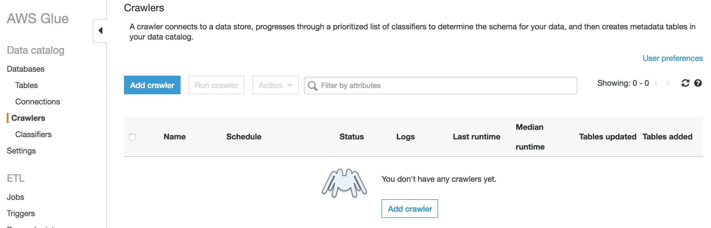
   
3. **Crawler name** text box'ına **[paraf]-movielens** yazın ve **Next** butonuna tıklayın.
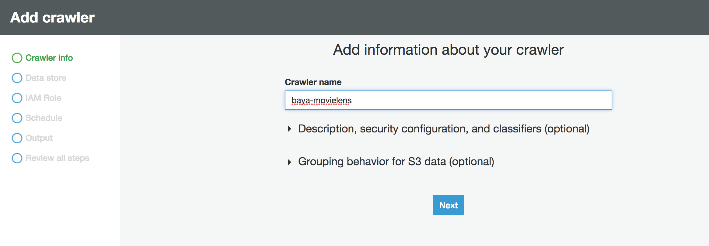

4. Verimizi S3'den alacağımız için **Choose a data store** açılır kutusunu **S3** olarak bırakın ve **Include path** metin kutusunun yanındaki **dosya ikonuna** tıklayın.
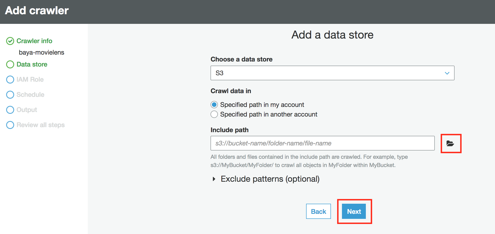

5. Yarattığınız S3 Bucket'ını açarak **movielens-data** folderını seçin ve **Select** butonuna tıklayın.
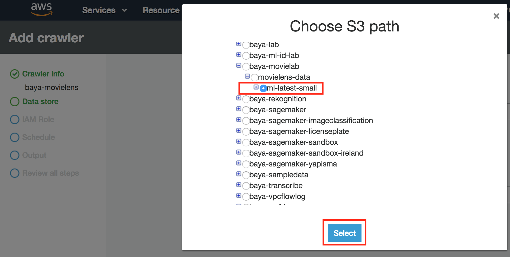

6. **Include path** metin kutusunun doğru S3 adresini içerdiğinden emin olun ve **Next** butonuna tıklayın.
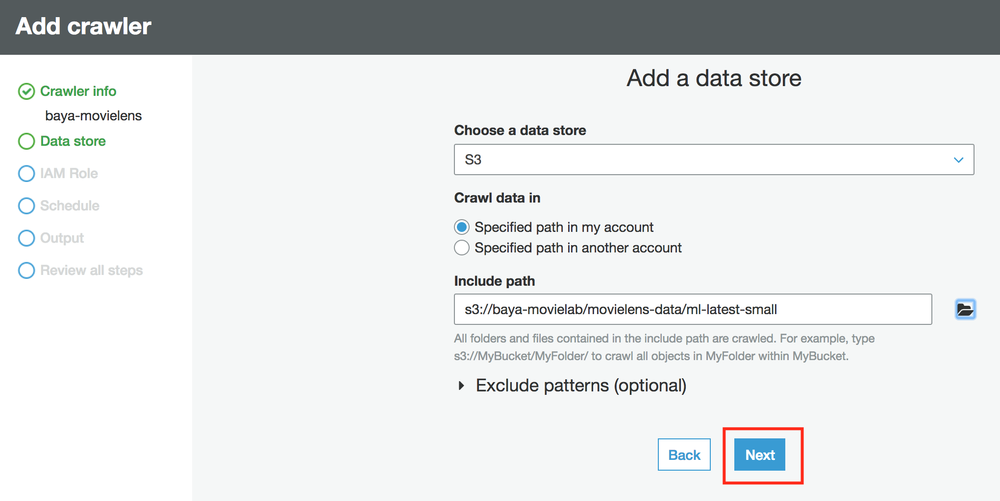

7. Crawler'a sadece bir tane veri kaynağı ekleyeceğimiz için **Next** butonuna tıklayın.
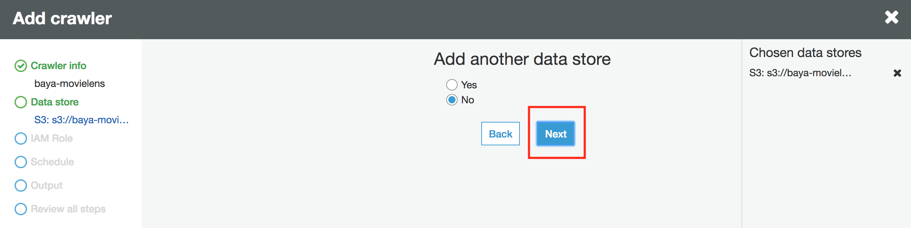

8. Crawler'ın içinde verimizi tutan S3 bucket'a erişmesi için yetkilendirilmesi gerekiyor. Bunun için Crawler'ın kullanabileceği yeni bir rol oluşturacağız. Ekranda **Create an IAM role** seçeneğinin işaretlendiğinden emin olun. **AWSGlueServiceRole-** metin kutusuna **[paraf]-lab** yazın. **Next** butonuna tıklayın.
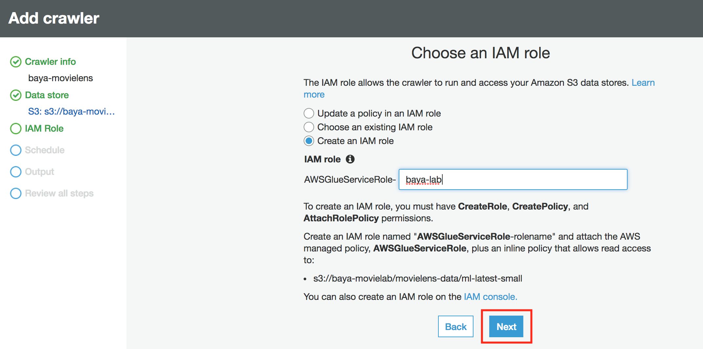

9. Crawler'ımız on-demand çalışacağından **Frequency** alanında bir değişiklik yapmayın, **Run on demand** olarak bırakın. Bucket'ınıza sürekli yeni veri eklenmesi gibi durumlarda scheduler kullanmak iyi bir seçenek olabilir.
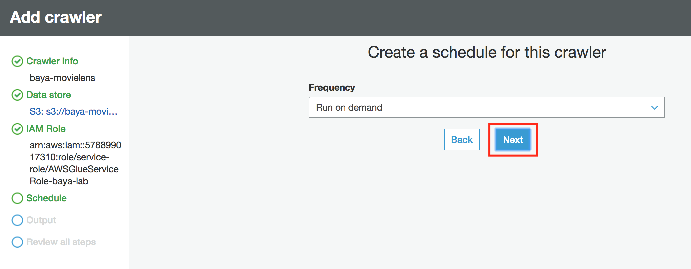

10. Crawler'ın görevi keşfettiği veri yapıları doğrultusunda yeni tablolar yaratmak. Bu tabloların yaratılması için bir Glue Metastore veritabanına ihtiyacımız var. **Add database** butonuna tıklayın.
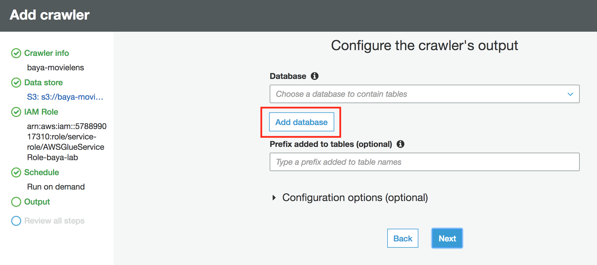

11. **Database name** alanına movielens yazın ve **Create** butonuna tıklayın
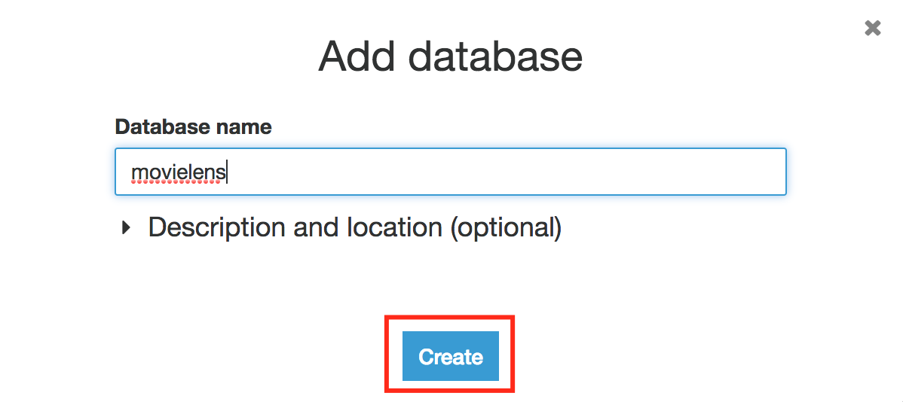

12. **Next** butonuna tıklayın
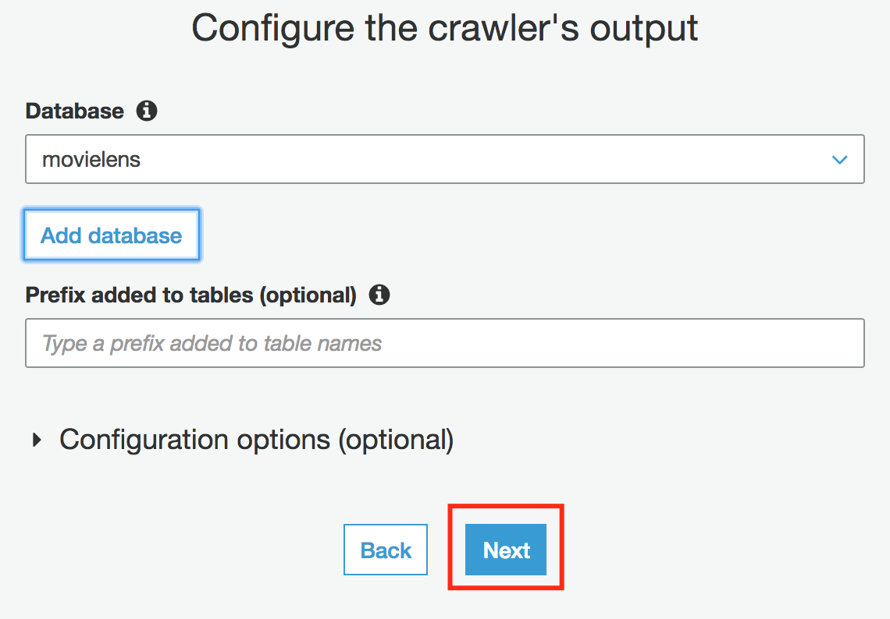

13. Crawler oluşturma sürecinin son adımına geldik. Finish butonuna tıklayın.
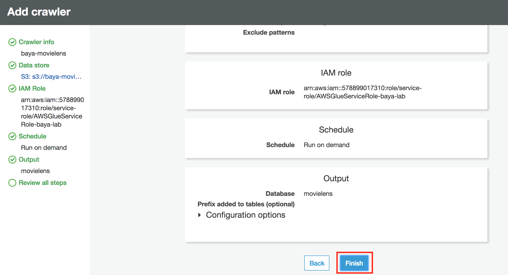

14. Crawler'ımızı çalıştırmak için yanındaki onay kutucuğunu işaretleyin ve yukarıdaki **Run crawler** butonuna tıklayın
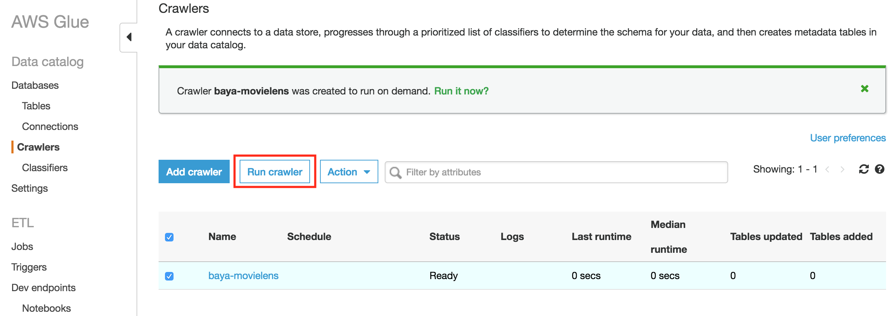

15. **Status** sütununun **Ready** olması için bir süre bekleyin. Crawling işlemi 1 dk kadar sürecektir
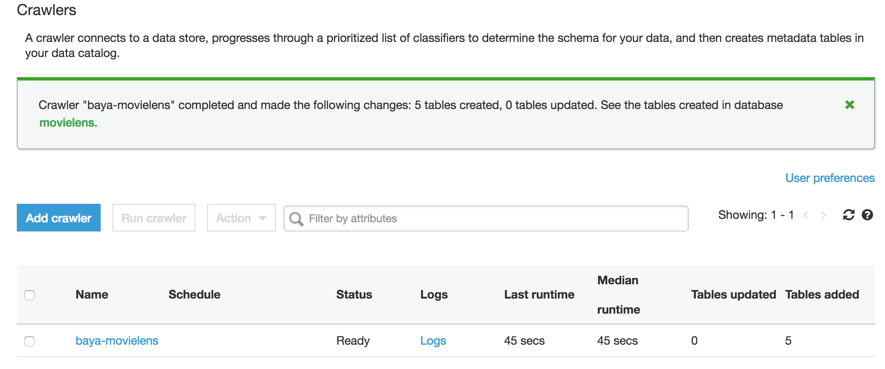

16. Sol taraftaki **Tables** linkine tıkladığınızda crawler'ınızın yeni tablolar keşfetmiş olduğunu göreceksiniz. Tablolar hakkında daha fazla detay için üzerine tıklayıp ve inceleyebilirsiniz.
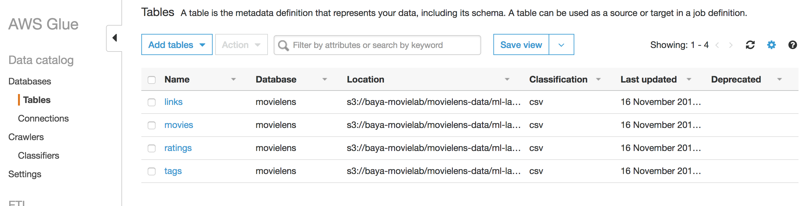

17. **ratings** tablosunun şema'sını inceleyerek her şeyin yolunda gittiğinden emin olun. Şemada **userid, movieid, rating, timestamp** isimlerinde 4 ayrı kolon olmalı ve bu kolonlar sırasıyla **bigint**, **bigint**, **double**, **bigint** tiplerinde olmalı.
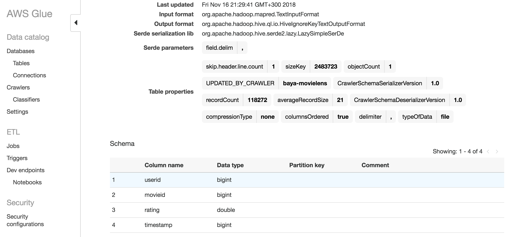

***

### <a name="explore">Amazon Athena ile veriyi inceleme</a>

Atölyenin 3. ve son bölümünde, S3 üzerinde bulunan verinizi doğrudan SQL ile sorgulamak için Amazon Athena kullanacaksınız. Bu ne tür veriniz olduğuna ve hangi tip ML modelleriyle eğitebileceğinize dair bazı ipuçları verecektir.

1. [Bu linki](https://console.aws.amazon.com/athena/home) kullanarak Amazon Athena konsoluna gidin. **Get Started** butonuna tıklayın

2. Amazon Athena, Glue Metadata store'da bulunan bütün veritabanlarını sorgulayabilir.  **Database** açılır listesinden movielens veritabanını seçin. 
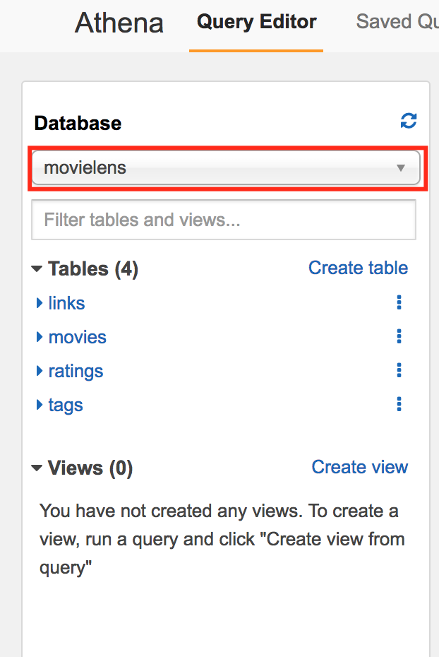

3. Sol tarafta Glue crawler'ın movielens veritabanında oluşturduğu tabloları görebilirsiniz. **ratings** tablosunun yanındaki **3 nokta** sembolüne tıklayın ve **Preview table**'ı seçin.
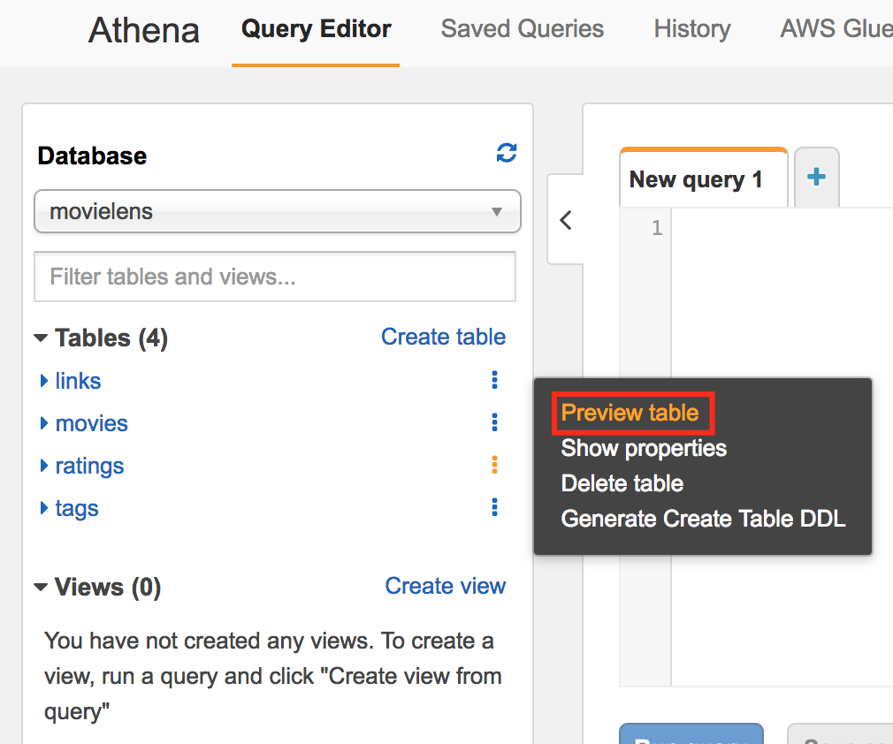

4. **Select** sorgusu otomatik olarak oluşturuldu ve çalıştırıldı. **result pane**'de tablonun satırlarını görebilirsiniz. Timestamp alanı epoch formatında gösterilmektedir.
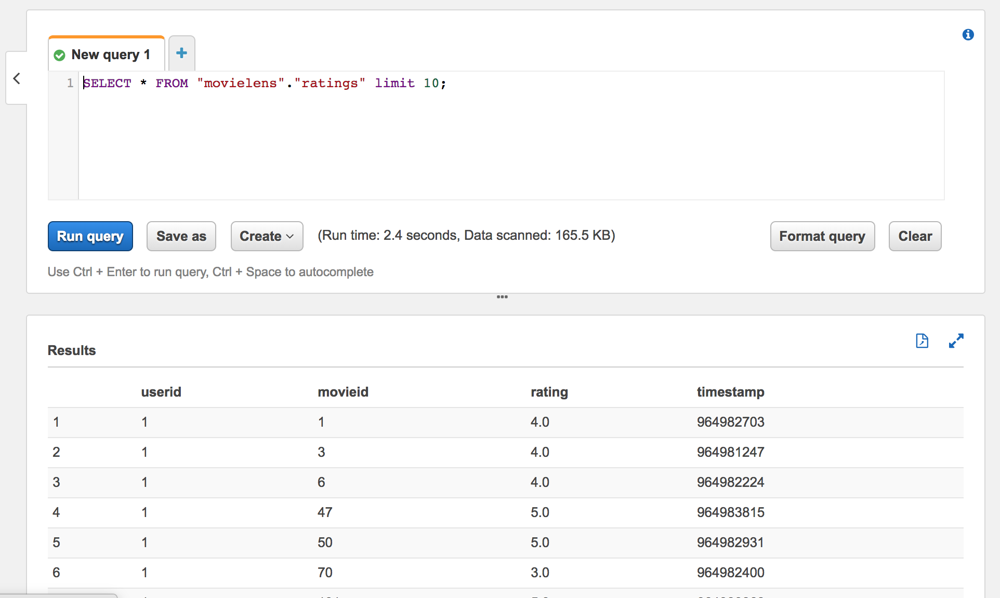

5. Aşağıdaki sorguyu  **query** kutucuğuna yapıştırıp **Run query** butonuna tıklayarak **ratings** tablosunu keşfedin:

   ```sql
    SELECT count(*) rowCount,
           count(distinct userid) AS userCnt,
           count(distinct movieid) AS movieCnt,
           min(rating) AS minRating,
           max(rating) AS maxRating
   FROM "ratings"
   ```
    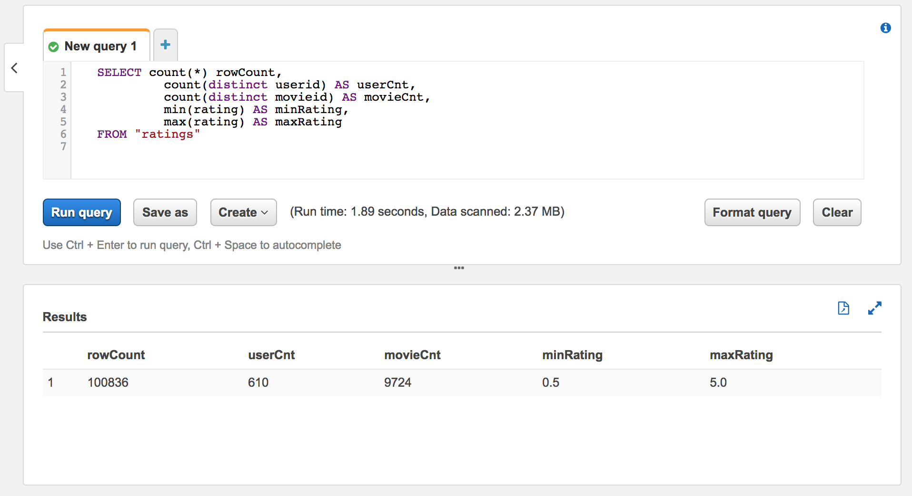


<div style="page-break-after: always;"></div>
6. **ratings** tablosunu biraz daha derinlemesine inceleyin.  **New query 1** tabının yanındaki **+** işaretine tıklayın ve aşağıdaki sorguyu açılan yeni tab'a yapıştırın:

   ```sql
   SELECT min(ratingsPerUser) minRatingsPerUser,
            max(ratingsPerUser) maxRatingsPerUser
   FROM 
       (SELECT userid,
            count(*) ratingsPerUser
       FROM "u_data"
       GROUP BY  userid )
   ```

   **Run query** butonuna tıklayın. Çıkan sonuçtan izleyicilerin en az ve en fazla kaç filmi puanladıklarını görebilirsiniz.

  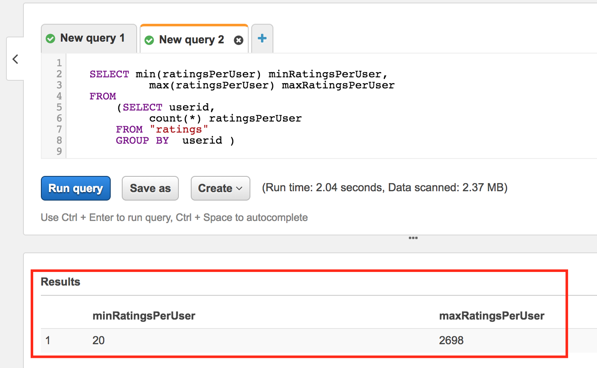

7. **+** sembolüne tıklayarak yeni bir sorgu ekranı açın ve **movies** tablosunun yanındaki **3 nokta**'ya tıklayarak **Preview table**'ı seçin.

8. **result pane**'de tablonun sahip olduğu sütunları inceleyin.

  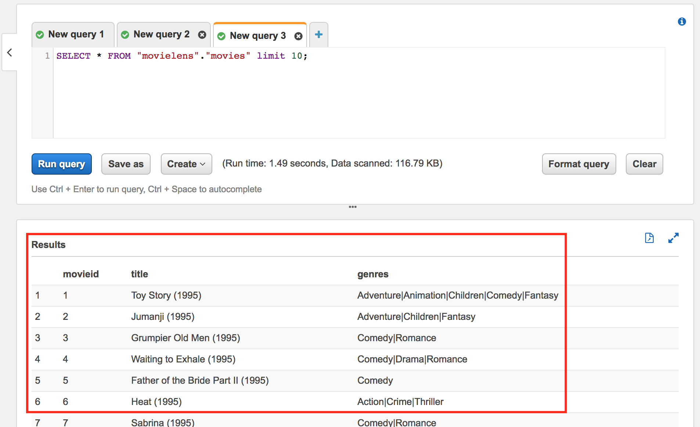

9. Aşağıdaki sorguyu **query** tabına girerek **ratings** ve **movies** tablolarını joinleyin:

   ```sql
   SELECT * FROM "ratings" ratings
   INNER JOIN "movies" movies on ratings.movieid = movies.movieid
   limit 10;
   ```

   **Run query** butonuna tıklayın ve Amazon Athena'nın doğrudan **S3**'deki datayı sorguladığını ve joinlediğini görün

   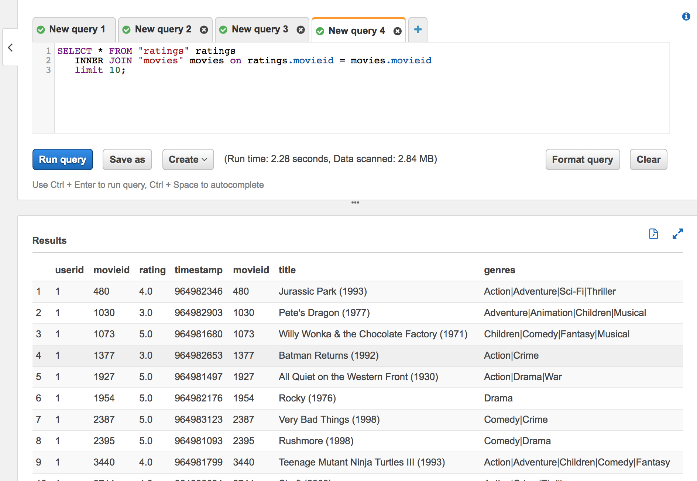

#### Tebrikler! Atölye 1'i tamamladınız.

Elinizdeki veri hakkında önemli bilgiler edindiniz. Sonraki atölye çalışmasında bu veriyi ML modeli oluşturmak için kullanacaksınız.